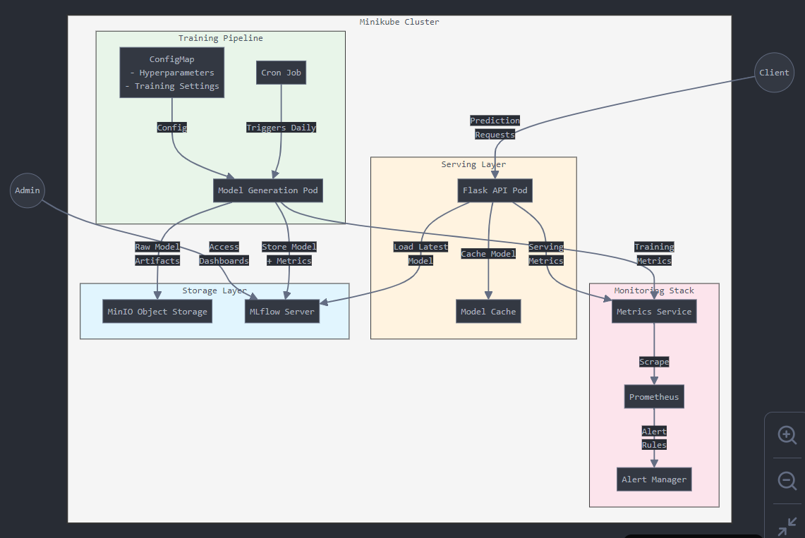
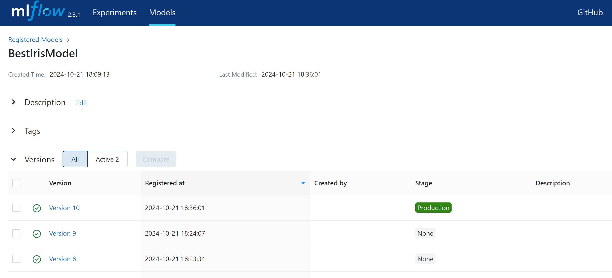
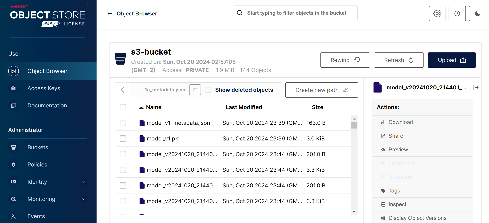
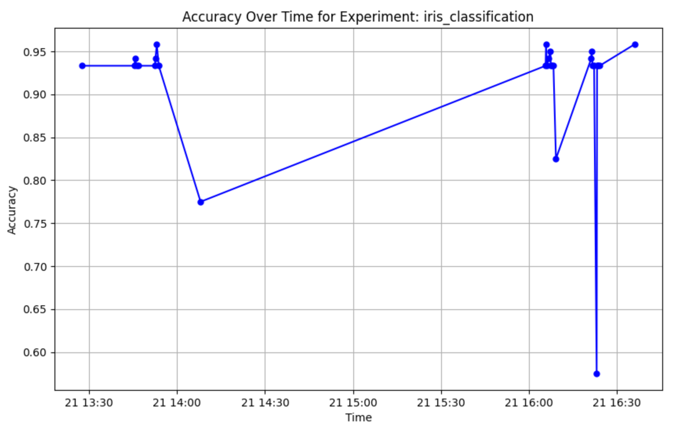
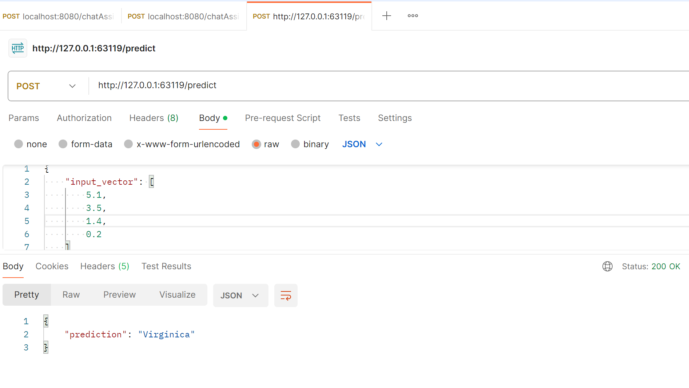

# iris-classification-mlops-minikube

This repository implements a complete ML model lifecycle with automated training, serving, and monitoring using Minikube, MLflow, MinIO, and Prometheus.

## Prerequisites

- Docker
- Minikube

## Project Structure

```
.
├── Docker_images/
│   ├── model-generation/
│   ├── model-api/
│   └── model-monitor/
└── namespaces-minikube/
    ├── namespace-secret-export.yaml/
    ├── namespace-configmaps-export.yaml/
    └── namespace-export.yaml
```

## System Architecture



The above diagram shows the overall system architecture including the interaction between different components.
## Deployment Instructions

### 1. Start Minikube

```bash
# Start Minikube with Docker driver
minikube start --driver=docker

# Enable required addons
minikube addons enable ingress
minikube addons enable metrics-server

# Set Docker environment to use Minikube's Docker daemon
eval $(minikube docker-env)
```

### 2. Build Docker Images

Build all required Docker images in Minikube's Docker daemon:

```bash
# Navigate to Docker_images directory
cd Docker_images

# Build model generation image
docker build -t model-generation:latest -f model-generation/Dockerfile .

# Build model API image
docker build -t model-api:latest -f model-api/Dockerfile .

# Build monitoring image
docker build -t model-monitor:latest -f model-monitor/Dockerfile .
```

### 3. Deploy Services

Apply Kubernetes manifests in the following order:

```bash
# Navigate to namespaces-minikube directory
cd namespaces-minikube

# 1. Apply secrets first
kubectl apply -f namespace-secret-export.yaml

# 2. Apply configmaps
kubectl apply -f namespace-configmaps-export.yaml

# 3. Apply all deployments, services, and other resources
kubectl apply -f namespace-export.yaml
```
### 4. Run an experiment manually

A cron Job is setup to run model training everyday, but it can also be executed manually by following job creation.

```bash
# Manual job to test model generation and logging 
kubectl create job --from=cronjob/ml-model-training ml-model-training-test -n=virtual-mind-task

# Delete the job
kubectl delete jobs ml-model-training-test -n=virtual-mind-task
```

### 5. Access Services

Access the deployed services using Minikube service command:

```bash
# Get MLflow UI URL
minikube service mlflow-service --url -n virtual-mind-task
```


```bash
# Get MinIO UI URL
minikube service minio-service --url -n virtual-mind-task
```


```bash
# Get Model API URL
minikube service model-api-service --url -n virtual-mind-task
```

```bash
# Get Prometheus UI URL
minikube service prometheus-service --url -n virtual-mind-task
```

## Service Details

### MinIO
- Object storage for model artifacts
- Access using the URL provided by Minikube service command
- Default credentials (unless modified in secrets):
  - Access Key: minio
  - Secret Key: minio123

### MLflow
- Tracks experiments, parameters, and metrics
- Stores registered models
- Access the UI using the provided Minikube service URL


### Model Generation
- Runs as a CronJob daily
- Trains Iris classifier
- Logs metrics and artifacts to MLflow
- Registers models that meet accuracy threshold
- Below is the visualisations for accuracy over time



### Model API
- Flask-based REST API
- Loads latest registered model from MLflow
- Example usage:
```bash
# Get the API URL
API_URL=$(minikube service model-api-service --url -n virtual-mind-task)

# Make prediction request
curl -X POST "${API_URL}/predict" \
  -H "Content-Type: application/json" \
  -d '{"features": [5.1, 3.5, 1.4, 0.2]}'
```


### Monitoring
- Prometheus-based monitoring
- Custom alerts for:
  - Model staleness (>36 hours)
  - Accuracy threshold violations
- Access Prometheus UI using the provided Minikube service URL

## Troubleshooting

1. Check pod status:
```bash
kubectl get pods -n virtual-mind-task
kubectl describe pod <pod-name> -n virtual-mind-task
```

2. View logs:
```bash
kubectl logs <pod-name> -n virtual-mind-task
```

3. Common issues:
- Ensure all Docker images are built in Minikube's Docker daemon
- Verify secrets are properly applied before other resources
- Check for namespace consistency across all resources
- Ensure services are accessible via Minikube service URLs

## Cleanup

```bash
# Delete all resources
kubectl delete -f namespaces-minikube/namespace-export.yaml
kubectl delete -f namespaces-minikube/configmaps/
kubectl delete -f namespaces-minikube/secrets/

# Stop Minikube
minikube stop
```
